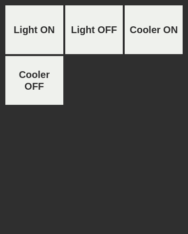

# rc.js
rc.js is a simple remote controller framework.



### Usage

**install**
```bash
npm install TakutoYoshikai/rcjs
```
**example**
```javascript
const Remocon = require("rcjs");

const remocon = new Remocon();

remocon.addButton("button title", function() {
  console.log("do something");
});

remocon.start(3000); //run server on 3000 port
```

### License
MIT License
